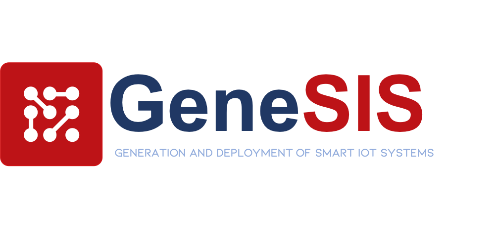
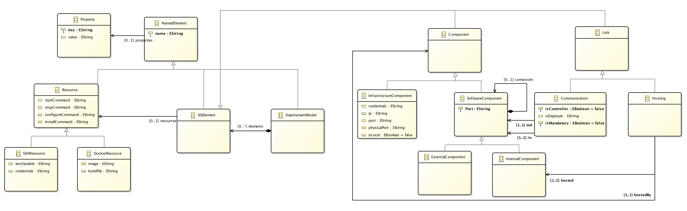

# GeneSIS
In the past years, multiple tools have emerged to support the building as well as the automated and continuous deployment of software systems with a specific focus on cloud infrastructures (e.g., Puppet, Chef, Ansible, Vagrant, Brooklyn, CloudML, etc.). However, very little effort has been spent on providing solution for the delivery and deployment of application across the whole IoT, edge and cloud space. In particular, there is a lack of languages and abstractions that can be used to support the orchestration of software services and their deployment on heterogeneous devices.

GeneSIS aims to facilitate the engineering and continuous deployment of smart IoT systems, allowing decentralized processing across heterogeneous the IoT, edge and cloud space. GeneSIS includes: (i) a domain specific modelling language to model the orchestration and deployment of smart IoT systems across the IoT, edge and cloud spaces; and (ii) an execution engine that will support the orchestration of IoT, edge and cloud services as well as their automatic deployment over IoT, edge and cloud resources.

## Metamodel (To be completed)

The GeneSIS Modelling language is inspired by component-based approaches in order to facilitate separation of concerns and reusability. In this respect, deployment models can be regarded as assemblies of components exposing ports, and bindings between these ports.

A _DeploymentModel_ consists of _SISElemenst_. All _SISElements_ have a _name_ and a unique _identifier_. In addition, they can all be associated with a list of _properties_ in the form of key-value pairs. The two main types of _SISElements_ are _Components_ and _Links_. 

A _Component_ represents a reusable type of node. It can be a _SoftwareComponent_ representing a piece of software to be deployed on an host. A _SoftwareComponent_ can be an _InternalComponent_ meaning that it is managed by GeneSIS, or an _ExternalComponent_ meaning that it is either managed by an external provider or hosted on a blackbox device. An _InfrastructureComponent_ provides hosting facilities (i.e, it provides an execution environment) to _SoftwareComponents_

There are two main types of _Links_. A _Hosting_ depicts that an _InternalComponent_ will execute on a specific host. A _Communication_ represents a communication binding between two _SoftwareComponents_.

More details of the GeneSIS modelling language can be found in the following paper:

## Installation

### Pre-requisite:
* Node.js v7
* npm v4
* Java v8

If you want to deploy docker containers, please remember to turn on the Docker Remote API on the target host. 
On Raspberry Pi, you can install docker using:

        curl -sSL https://get.docker.com | sh

and configure it as follows:
* Create a file called:

        /etc/systemd/system/docker.service.d/startup_options.conf

* Add to the file:

        # /etc/systemd/system/docker.service.d/override.conf
        [Service]
        ExecStart=
        ExecStart=/usr/bin/dockerd -H tcp://0.0.0.0:2376 -H unix:///var/run/docker.sock

* Reload the unit files

        sudo systemctl daemon-reload

* Restart Dockerd

        sudo systemctl restart docker.service

### From git:
If you want to run the latest code from git, here's how to get started:

1. Clone the code:

        git clone https://gitlab.com/enact/GeneSIS.git
        cd GeneSIS

2. Install the dependencies

        npm install

4. Run

        npm start

5. Access the GeneSIS web interface

Once GeneSIS started, you can access the GeneSIS web interface at the following address:

        http://your_pi:8880

### From DockerFile:
You may build your own Docker image of GeneSIS by using our DockerFile. This image will run the latest code from git. 

1. Download the DockerFile:

        wget -L https://gitlab.com/enact/GeneSIS/raw/master/Dockerfiles/Dockerfile

2. In the repository where you downloaded the DockerFile, build your image:

        docker -t genesis build .

3. Run the docker container (Depending on how you plan to use GeneSIS, remember to open the proper ports, cf. https://docs.docker.com/engine/reference/run/).

        docker run -d -p 8880:8880 -p 9001:9001 -p 8000:8000 genesis

4. Access the GeneSIS web interface

Once GeneSIS started, you can access the GeneSIS web interface at the following address:

        http://your_pi:8880

### From the public Docker image:
1. Pull the image:

        docker pull nicolasferry/genesis

2. Run the docker container (Depending on how you plan to use GeneSIS, remember to open the proper ports, cf. https://docs.docker.com/engine/reference/run/).

        docker run -p 8880:8880 genesis

3. Access the GeneSIS web interface

Once GeneSIS started, you can access the GeneSIS web interface at the following address:

        http://your_pi:8880

## Architecture
