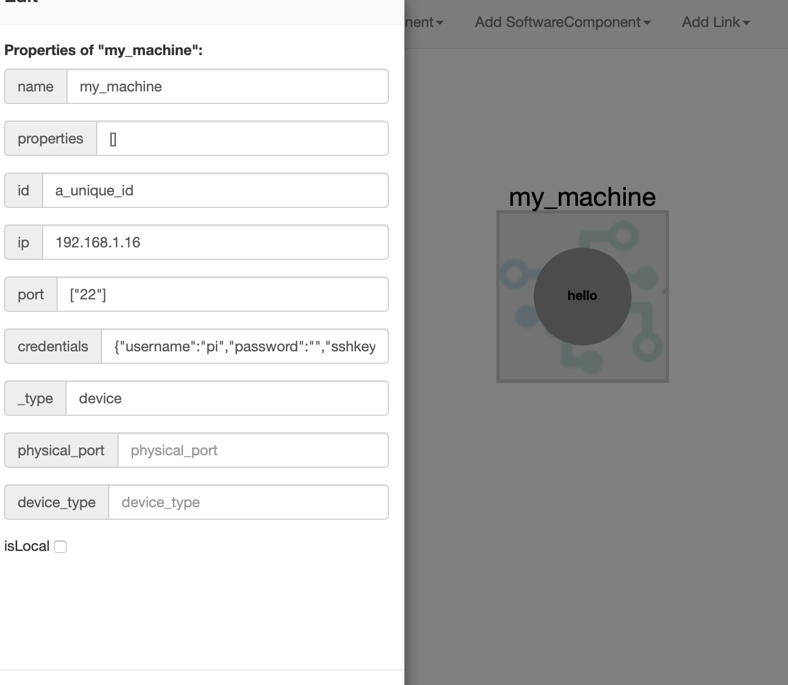
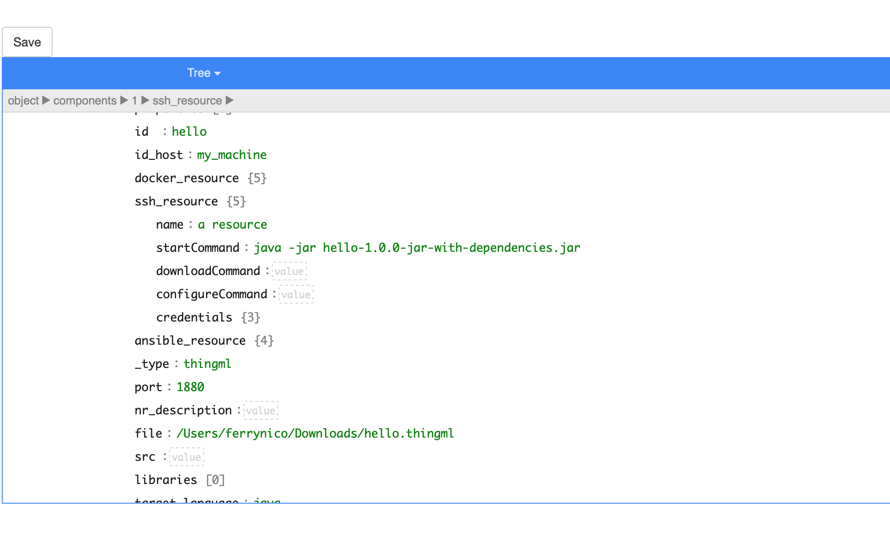
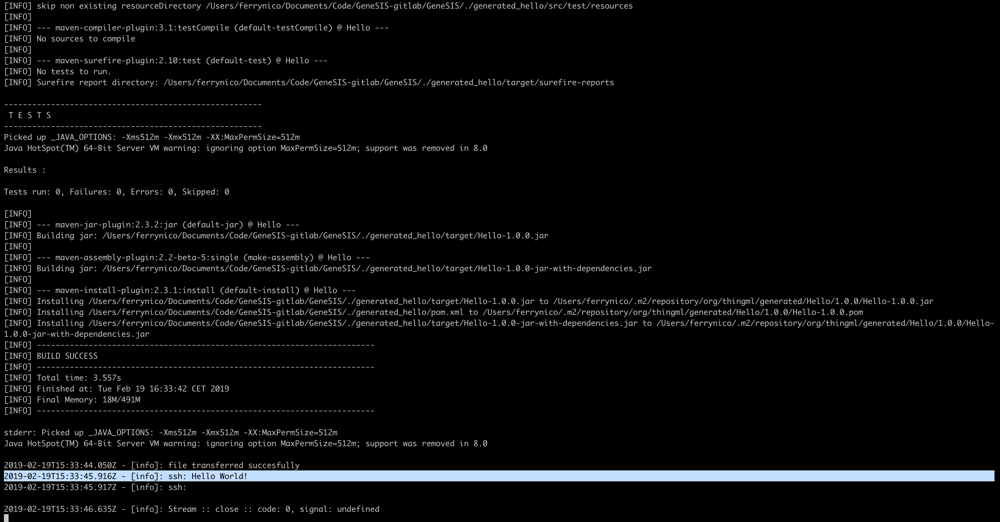

# Deploying a ThingML program

In this example we will simply deploy a program written in ThingML on the machine running GeneSIS (or on any machine accessible via SSH).

GeneSIS offers specific support for the deployment of ThingML programs. [ThingML](http://thingml.org/) is a domain specific language for modelling distributed IoT systems including the behavior of the distributed components in a platform-specific or -independent way. From a ThingML code, the ThingML compiler can generate code in different languages, targeting around 10 different target platforms (ranging from tiny 8 bit microcontrollers to servers). This is particularly interesting for GeneSIS as, from a deployment model, the GeneSIS execution engine can identify the host to which a ThingML source code should be allocated and thus generate code in the relevant language before compiling and deploying it on the host. 
The deployment of a ThingML program by GeneSIS consist in: (i) Compiling the ThingML program toward a specific target language, (ii) building the generated code, and (iii) deploying and starting it.

For this tutorial, we assume that (i) the machine running GeneSIS (or any other machine) is accessible via SSH, and (ii) GeneSIS is properly installed on the machine.

## Start GeneSIS:

First, let’s start GeneSIS by using the following command in the root folder of GeneSIS:

        npm start

You should see the following message:

        > GeneSIS@0.0.1 start /Users/ferrynico/Documents/Code/GeneSIS-gitlab/GeneSIS
        > node ./app.js
        
        2019-02-18T09:03:41.393Z - [info]: Engine started!
        2019-02-18T09:03:41.404Z - [info]: PlantUML diagram generator started on port: 8080
        2019-02-18T09:03:41.406Z - [info]: MQTT server listening on port 1883
        2019-02-18T09:03:41.407Z - [info]: Magic happens on port 8880

Once GeneSIS started, you can access the GeneSIS editor at the following address:

        http://127.0.0.1:8880

## Specifying the deployment model

We can now start specifying our deployment model. 
In this example, our deployment model will be composed of two components: 
* a _SoftwareComponent_ (i.e., representing the program written in ThingML that will be deployed by GeneSIS) and more precisely an _InternalComponent_ as its deployment life-cycle will be managed by GeneSIS.
* an _InfrastructureComponent_ (i.e., the host on top of which we will deploy our SoftwareComponent).

First, we start by creating the InfrastructureComponent by clicking on 'InfrastructureComponent > Device'.
In the creation form we specify its 'name' and 'id' and we fill the field 'IP' with the IP address of the host on top of which our program written in ThingML will be deployed. Once the form completed we can click on the 'add' button to actually add the component in the deployment model.
For details on how to manipulate and edit components with the GeneSIS editor, please refer to our [first tutorial](https://gitlab.com/enact/GeneSIS/tree/master/docs/examples/1.nodered_localhost).

We can now create the SoftwareComponent by clicking on 'SoftwareComponent > InternalComponent > thingml'. For this tutorial we provide a simple [ThingML Hello world program](https://gitlab.com/enact/GeneSIS/blob/master/docs/examples/2.thingml_localhost/hello.thingml) whose name is Hello (i.e., name of the _Configuration_ in ThingML).
For GeneSIS to fully support the deployment, compilation and deployment of ThingML programs it is important that **the name of the ThingML InternalComponent is the same than the name of the ThingML program**. We thus set the name of our component to Hello.
We also need to fill the field "File" with the path to the [Hello.thingml](https://gitlab.com/enact/GeneSIS/blob/master/docs/examples/2.thingml_localhost/hello.thingml) file.

Finally, because there might be different ways to start the binary generated from the ThingML program, we need to specify how to start it.
For that, we will use a _SSH-Resource_. In the GeneSIS Modelling language A _SoftwareComponent_ can be associated with _Resources_ (e.g., scripts, configuration files) adopted to manage its deployment life-cycle (i.e., download, configure, install, start, and stop).
In our case we need to define (i) the _startCommand_ of our SSH-Resource describing how to start our SoftwareComponent and (ii) the credentials for accessing our Host.

We also need to specify that we should generate Java code from our ThingML program. To do so, we set the property 'target_language' to java.

Finally, we specify that our InternalComponent will be deployed on our InfrastructureComponent. To do so, we need to create a containement relationship between the two components by clicking on 'Add Link > Containment'.
Select the proper nodes and click on the 'add' button.

## Deploy

Click on 'Deploy > All'. This will send our deployment model to the GeneSIS deployment engine and trigger the deployment.

Once the deployment started, you can observe deployment logs in the console where you started GeneSIS. In particular, you will see: (i) the ThingML compiler generating the Java code, (ii) the generated code being build, and (iii) the generated binary being uploaded on the target host before it is started.
Once the deployment completed, you should see the logs depicted in the figure below (please note that the highlighted line indicates the result of the execution of the ThingML program). 

