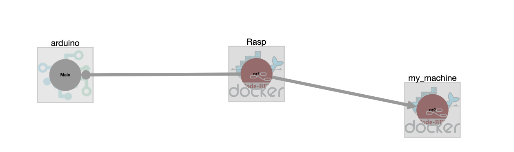

# Deployment agent

In this example we will simply deploy two Node-Red containers via Docker and an Arduino sketch on an arduino board. This will result in the deployment depicted in the following figure.
One Node-RED will be deployed on a raspberry pi whilst the second will be on the machine running GeneSIS.
The Arduino board is connected to the Raspberry pi using /dev/ttyACM0.

## Start GeneSIS:

First, let’s start GeneSIS by using the following command in the root folder of GeneSIS:

        npm start

You should see the following message:

        > GeneSIS@0.0.1 start /Users/ferrynico/Documents/Code/GeneSIS-gitlab/GeneSIS
        > node ./app.js
        
        2019-02-18T09:03:41.393Z - [info]: Engine started!
        2019-02-18T09:03:41.404Z - [info]: PlantUML diagram generator started on port: 8080
        2019-02-18T09:03:41.406Z - [info]: MQTT server listening on port 1883
        2019-02-18T09:03:41.407Z - [info]: Magic happens on port 8880

Once GeneSIS started, you can access the GeneSIS editor at the following address:

        http://127.0.0.1:8880

## Specifying the deployment model

First, we create the two docker hosts:
1. Create the first docker host (the raspberry pi): 'InfrastructureComponent > Docker Engine'
2. Specify its name, id, port (e.g., 2376) and ip address (e.g., 192.168.1.40)
3. Create the second docker host (the machine running genesis): 'InfrastructureComponent > Docker Engine'
4. Specify its name, id, port (e.g., 2376) and ip address (e.g., 127.0.0.1)

Then we create the two instances of Node-RED:
1. Create the first internal component (on the raspberry pi): 'SoftwareComponent > InternalComponent > Nodered'
2. Specify its name and id.
3. Specify the port binding in the Docker_resource (e.g., 1880:1880).
4. Specify the path to a Node-RED flow to be uploaded on this instance: path_flow: /home/user/myflow
5. If needed, use the property _packages_ to specify the list of node types to be installed together with the Node-RED flow
6. Repeat the same operations for the second instance of Node-RED.

We allocate the Node-RED on their hosts: 'Add Link > Containment'

We can now create the host representing our Arduino:
1. Create a infrastructure component of type device: 'InfrastructureComponent > Device'
2. Specify its name, id, the physical port it uses to communicate with the raspberry pi (e.g., physical_port: /dev/ttyACM0), and the type of the device (i.e., device-type: arduino)

Then we create the arduino software component to be deployed on the device:
1. Create an internal component: 'SoftwareComponent > InternalComponent > arduino'
2. Specify its name, id, the path to the arduino sketch to be deployed (e.g., sketch: /Users/MainCfg.ino), the libraries required to run the sketch (e.g., libraries: ["Adafruit GFX Library","Adafruit ST7735 and ST7789 Library"])

