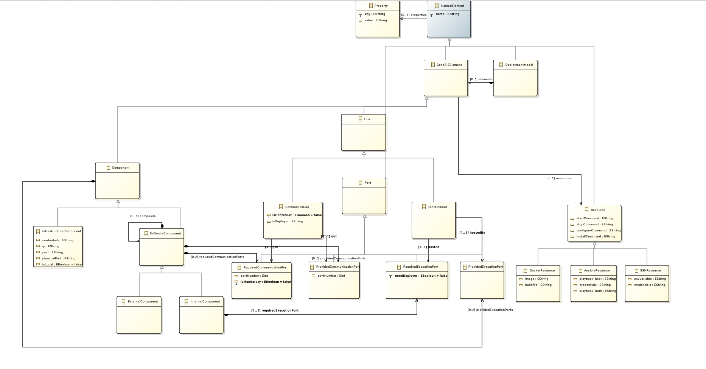

# Metamodel (To be completed)

The GeneSIS Modelling language is inspired by component-based
approaches in order to facilitate separation of concerns and
reusability. In this respect, deployment models can be regarded as
assemblies of components exposing ports, and bindings between these
ports.

A _DeploymentModel_ consists of _SISElemenst_. All _SISElements_ have
a _name_ and a unique _identifier_. In addition, they can all be
associated with a list of _properties_ in the form of key-value
pairs. The two main types of _SISElements_ are _Components_ and
_Links_.

A _Component_ represents a reusable type of node. It can be a
_SoftwareComponent_ representing a piece of software to be deployed on
an host. A _SoftwareComponent_ can be an _InternalComponent_ meaning
that it is managed by GeneSIS, or an _ExternalComponent_ meaning that
it is either managed by an external provider or hosted on a blackbox
device. An _InfrastructureComponent_ provides hosting facilities (i.e,
it provides an execution environment) to _SoftwareComponents_

There are two main types of _Links_. A _Hosting_ depicts that an
_InternalComponent_ will execute on a specific host. A _Communication_
represents a communication binding between two _SoftwareComponents_.

More details of the GeneSIS modelling language can be found in the
following paper:
