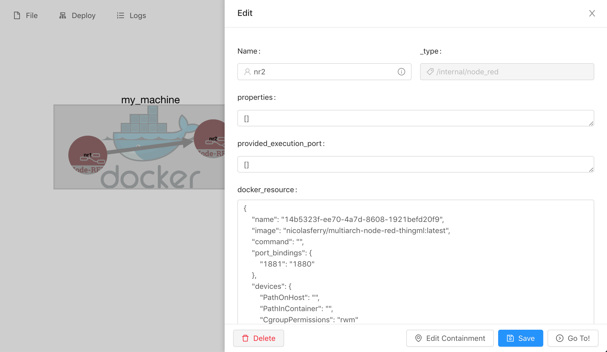
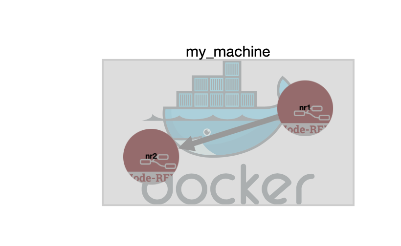
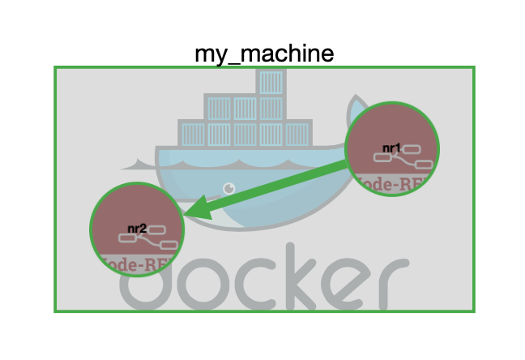
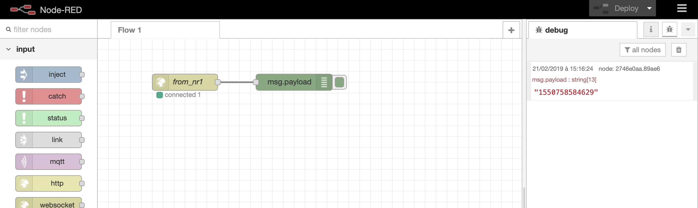

# Deploying Node-RED on a Docker engine

In this example we will simply deploy two linked Node-Red containers via Docker on the machine running GeneSIS. 

Here, we assume that (i) a Docker engine is up on the machine running GeneSIS and with the Docker Remote engine accessible, and (ii) GeneSIS is properly installed on the machine.

## Start GeneSIS:

First, let’s start GeneSIS by using the following command in the root folder of GeneSIS:

        npm start

You should see the following message:

        > GeneSIS@0.0.1 start /Users/ferrynico/Documents/Code/GeneSIS-gitlab/GeneSIS-v2/GeneSIS
        > concurrently "nodemon ./app.js" "webpack-dev-server "

        [0] [nodemon] 1.18.11
        [0] [nodemon] to restart at any time, enter `rs`
        [0] [nodemon] watching: *.*
        [0] [nodemon] starting `node ./app.js`
        [0] 2019-05-09T08:21:11.413Z - [info]: Engine started!
        [0] 2019-05-09T08:21:11.526Z - [info]: PlantUML diagram generator started on port: 8080
        [0] 2019-05-09T08:21:11.537Z - [info]: GeneSIS Engine API started on 8000
        [0] 2019-05-09T08:21:11.538Z - [info]: MQTT websocket server listening on port 9001
        [0] 2019-05-09T08:21:11.807Z - [info]: New MQTT client mqttjs_a07f9e19
        [0] 2019-05-09T08:21:11.910Z - [info]: subscribe from client [object Object],[object Object] from mqttjs_a07f9e19
        [1] ℹ ｢wds｣: Project is running at http://localhost:8880/
        [1] ℹ ｢wds｣: webpack output is served from http://127.0.0.1:8880/dist/
        [1] ℹ ｢wds｣: Content not from webpack is served from /Users/ferrynico/Documents/Code/GeneSIS-gitlab/GeneSIS-v2/GeneSIS/public/
        [0] 2019-05-09T08:21:12.563Z - [info]: New MQTT client mqttjs_1c4fef2a

Once GeneSIS started, you can access the GeneSIS editor at the following address:

        http://127.0.0.1:8880

## Specifying the deployment model

In this example, our deployment model will be composed of three components: 
* two _SoftwareComponent_ (i.e., the Node-RED container that will be deployed by GeneSIS) and more precisely an InternalComponent as its deployment life-cycle will be managed by GeneSIS.
* an _InfrastructureComponent_ (i.e., the host on top of which we will deploy our SoftwareComponent, in our case a DockerEngine).

First we start by creating the InfrastructureComponent by clicking on 'Edit > Infrastructure Component > Docker Engine'
At the current moment just specify its 'name', 'IP', and the port of the Docker engine. We can add the component into the deployment model by  clicking on the 'OK' button. A rectangle should appear!

Now we can create the first InternalComponent by clicking on 'Edit > Software Component > Internal > Node-RED'. 
We need to specify, the 'name' of the component, the 'provided-communication-port' it will be accessible from, and the Docker port binding in the _Docker-ressource_ (i.e., how the port of the service running in the Docker container will be accessible from outside).
Docker port binding take following form "port-for-outside:port-for-inside_container" Typically, Node-RED is exposed using port 1880.

We will now specify that our InternalComponent will be deployed on our InfrastructureComponent (i.e., Node-RED on Docker).
To do so, we need (i) to specify the execution ports of our components and (ii) to create a containement relationship between the two components.
We first specify the provided execution port of the docker host (i.e., the_machine). Right-click on the Docker Host and change the name of the 'provided execution port' property (e.g., offerDocker).
Similarly right-click on the Software component (i.e., nodered) and change the name of the required execution port (e.g., demandDocker).

Then we can add the containment relationship by clicking on 'Edit > Link > Add Containment'.
Select the proper nodes and click on 'add'.

We can now create the second InternalComponent. For that we can follow the same process as below but we should make sure that we will expose our container on another port as 1880 is already used.
You can for instance proceed as depicted in the figure below.

We can now specify that our InternalComponent will be deployed on our InfrastructureComponent (i.e., Node-RED on Docker). 
To do so, we need (i) to specify the execution ports of our components and (ii) to create a containement relationship between the two components.
We first specify the provided execution port of the docker host (i.e., the_machine). Right-click on the Docker Host and change the name of the 'provided execution port' property (e.g., offerDocker).
Similarly right-click on the Software component (i.e., nodered2) and change the name of the required execution port (e.g., demandDocker).

Then we can add the containment relationship by clicking on 'Edit > Link > Add Containment'.
Select the proper nodes and click on 'add'.

Finally, we specify that our first InternalComponent will send data to the second one. For that we can use a _communication_ link between the two components.
To create this communication click on Add Link > Communication', select the two components, and click on the 'add' button.
The resulting deployment model should look as depicted in the Figure below.

## Deploy

Click on 'Deploy > All'.

The deployment is completed when all components and arrows are green (see Figure below).

Finally, you can access to your Node-RED by right-clicking on the component in the graph view of the editor and by clicking on the “Go To” button.
You will see that components have been instanciated and configured in both Node-RED containers (see Figure Below). These are websocket components that will allow the communication between the two containers (please note that these components may take some time before being connected to each other). 

That's all folks!

