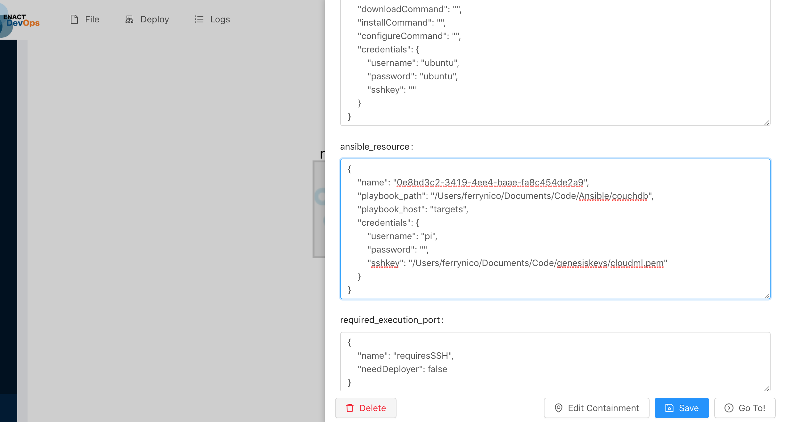
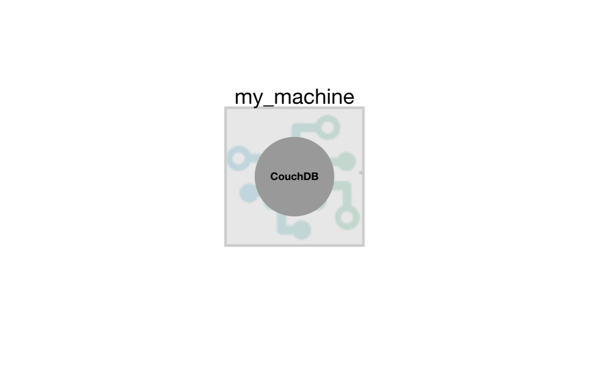

# Deploying CouchDB with Ansible.

In this example we will simply deploy CouchDB via Ansible on the machine running GeneSIS or any other machine accessible via SSH. 

Here, we assume that (i) Ansible is up on the machine running GeneSIS, and (ii) GeneSIS is properly installed on the machine.

## Start GeneSIS:

First, let’s start GeneSIS by using the following command in the root folder of GeneSIS:

        npm start

You should see the following message:

        > GeneSIS@0.0.1 start /Users/ferrynico/Documents/Code/GeneSIS-gitlab/GeneSIS-v2/GeneSIS
        > concurrently "nodemon ./app.js" "webpack-dev-server "

        [0] [nodemon] 1.18.11
        [0] [nodemon] to restart at any time, enter `rs`
        [0] [nodemon] watching: *.*
        [0] [nodemon] starting `node ./app.js`
        [0] 2019-05-09T07:28:29.357Z - [info]: Engine started!
        [0] 2019-05-09T07:28:29.452Z - [info]: PlantUML diagram generator started on port: 8080
        [0] 2019-05-09T07:28:29.469Z - [info]: GeneSIS Engine API started on 8000
        [0] 2019-05-09T07:28:29.471Z - [info]: MQTT websocket server listening on port 9001
        [0] 2019-05-09T07:28:29.639Z - [info]: New MQTT client mqttjs_52139cc4
        [0] 2019-05-09T07:28:29.701Z - [info]: subscribe from client [object Object],[object Object] from mqttjs_52139cc4
        [1] ℹ ｢wds｣: Project is running at http://localhost:8880/
        [1] ℹ ｢wds｣: webpack output is served from http://127.0.0.1:8880/dist/
        [1] ℹ ｢wds｣: Content not from webpack is served from /Users/ferrynico/Documents/Code/GeneSIS-gitlab/GeneSIS-v2/GeneSIS/public/
        [0] 2019-05-09T07:28:30.489Z - [info]: New MQTT client mqttjs_75f09b96

Once GeneSIS started, you can access the GeneSIS editor at the following address:

        http://127.0.0.1:8880

## Specifying the deployment model

In this example, our deployment model will be composed of two components: 
* a _SoftwareComponent_ (i.e., the CouchDB that will be deployed by GeneSIS) and more precisely an InternalComponent as its deployment life-cycle will be managed by GeneSIS.
* an _InfrastructureComponent_ (i.e., the host on top of which we will deploy our SoftwareComponent).

First, we start by creating the InfrastructureComponent by clicking on 'Edit > Infrastructure Component > Device'.
In the creation form we specify its 'name' and we fill the field 'IP' with the IP address of the host on top of which CouchDB will be deployed. Once the form completed we can click on the 'OK' button to actually add the component in the deployment model.

For details on how to manipulate and edit components with the GeneSIS editor, please refer to our [first tutorial](https://gitlab.com/enact/GeneSIS/tree/master/docs/examples/1.nodered_localhost).

We can now create the SoftwareComponent by clicking on 'Edit > Software Component > Internal > Generic InternalComponent'.
We start by specifying, the 'name' of the component, and the 'provided communication port' it will be accessible from (typically 5984 for CouchDB).

We can now define how to install, configure and start CouchDB by associating an _Ansible-Resource_ to our InternalComponent. In the GeneSIS Modelling language A _SoftwareComponent_ can be associated with _Resources_ (e.g., scripts, configuration files) adopted to manage its deployment life-cycle (i.e., download, configure, install, start, and stop).

_Ansible-Resources_ are typically used to call Ansible playbook. This example is provided with couchdb.yml as a playbook to install CouchDB. To tell GeneSIS to use a specific playbook you need to specify the path to the later in the _playbook path_ property (e.g., /Users/Documents/Code/Ansible/couchdb). To understand on which machine the commands in the playbook should be triggered Ansible leverage hosts files. Based on the deployment model, GeneSIS can automatically generate such configuration file. The location of the generated file needs to be specified using the _playbook host_ property. Finally, so far GeneSIS configures Ansible to run its configuration commands over SSH. This means that (i) SSH should be enabled on the target host and (ii) we need to provide GeneSIS with the required credentials using the _credentials_ property. 

Finally, we specify that our InternalComponent will be deployed on our InfrastructureComponent. To do so, we need (i) to specify the execution ports of our components and (ii) to create a containement relationship between the two components.
We first specify the provided execution port of the host (i.e., my_machine). Right-click on the  Host and change the name of the 'provided execution port' property (e.g., offerLinux).
Similarly right-click on the Software component (i.e., couchdb) and change the name of the required execution port (e.g., demandLinux).

Then we can add the containment relationship by clicking on 'Edit > Link > Add Containment'.
Select the proper nodes and click on 'add'.

## Deploy
Click on 'Deploy > All'. This will send our deployment model to the GeneSIS deployment engine and trigger the deployment.

You can observe the installation of CouchDB as the Ansible outputs are displayed in the GeneSIS logs

                [0] 2019-05-09T13:52:21.194Z - [info]: Stopping removed containers
                [0] 2019-05-09T13:52:21.196Z - [info]: Starting deployment
                [0] 2019-05-09T13:52:21.198Z - [info]: Starting deployment of deployment agents
                [0] 2019-05-09T13:52:21.198Z - [info]: Deployment agents deployed
                [0] 2019-05-09T13:52:23.708Z - [info]:
                [0] PLAY [Install couchdb] *********************************************************
                [0]
                [0] 2019-05-09T13:52:23.726Z - [info]:
                [0] TASK [Gathering Facts] *********************************************************
                [0]
                [0] 2019-05-09T13:52:30.381Z - [info]: ok: [192.168.1.16]
                [0]
                [0] 2019-05-09T13:52:30.427Z - [info]:
                [0] TASK [ensure couchdb is at the latest version] *********************************

Once the deployment started, you can observe deployment logs in the console where you started GeneSIS. In particular, you will see: 
Once the deployment completed, you should see the logs depicted in the figure below.

That's all folks!

