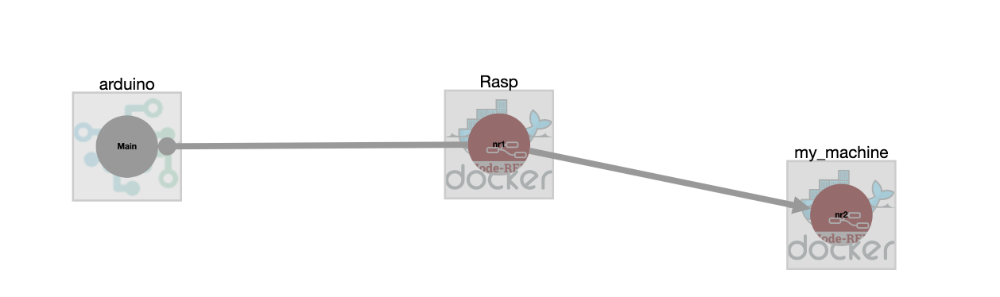
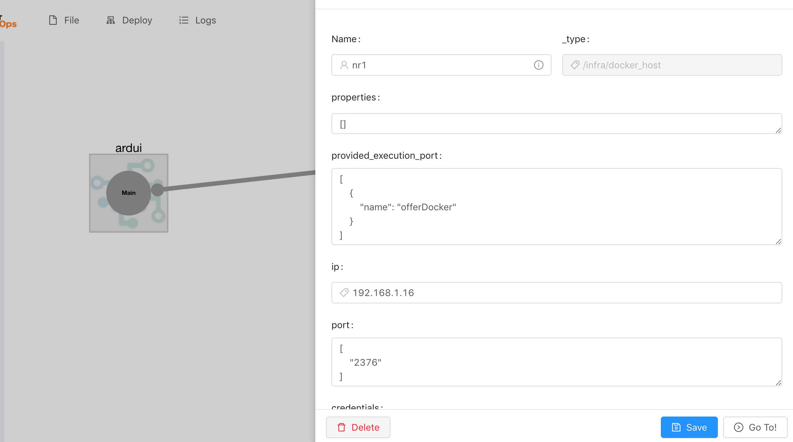
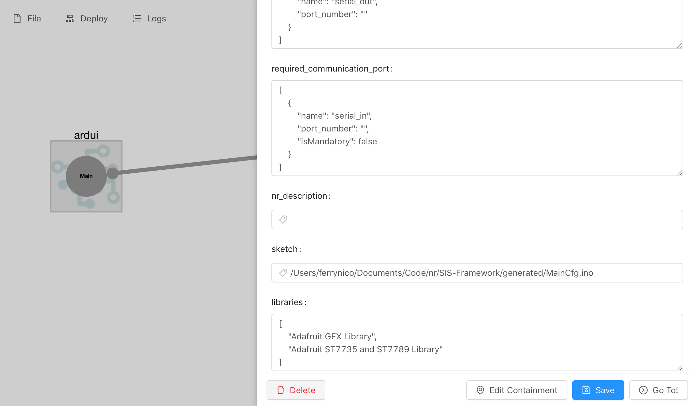
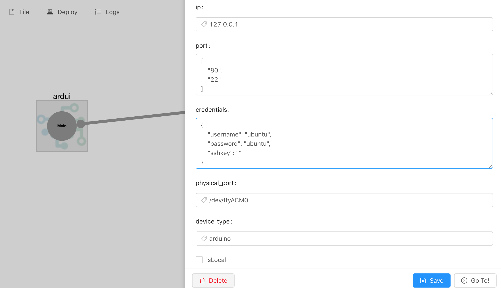
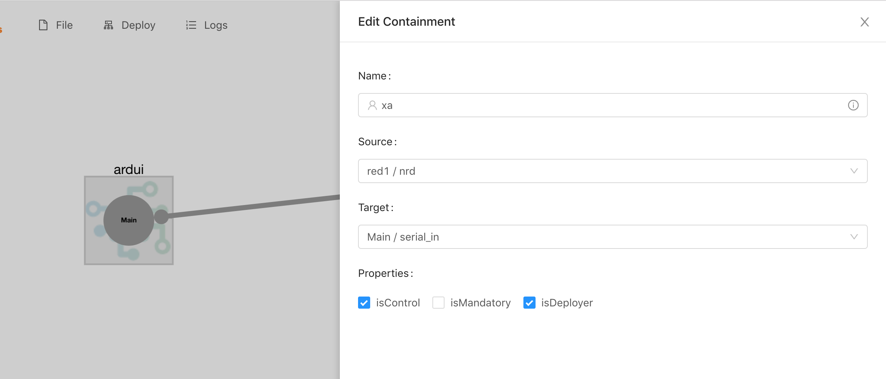
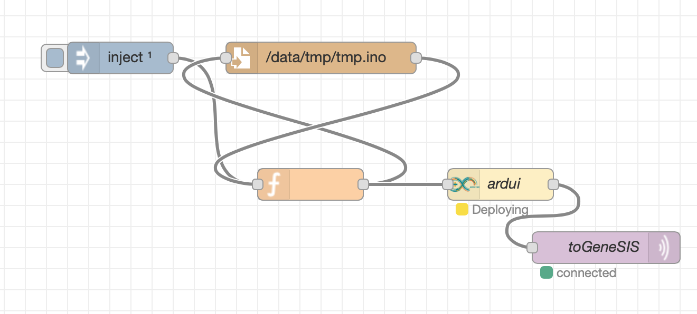

# Deployment agent

In this example we will simply deploy two Node-Red containers via Docker and one Arduino sketch on an arduino board. This will result in the deployment depicted in the following figure.
One Node-RED will be deployed on a Raspberry PI whilst the second will be deployed on the machine running GeneSIS.
The Arduino board is connected to the Raspberry pi using _/dev/ttyACM0_.

Here, we assume that (i) a Docker engine is up on both the Raspberry PI and on the machine running GeneSIS and with the Docker Remote engine accessible, and (ii) GeneSIS is properly installed on the machine.

## Start GeneSIS:

First, let’s start GeneSIS by using the following command in the root folder of GeneSIS:

        npm start

You should see the following message:

        > GeneSIS@0.0.1 start /Users/ferrynico/Documents/Code/GeneSIS-gitlab/GeneSIS-v2/GeneSIS
        > concurrently "nodemon ./app.js" "webpack-dev-server "

        [0] [nodemon] 1.18.11
        [0] [nodemon] to restart at any time, enter `rs`
        [0] [nodemon] watching: *.*
        [0] [nodemon] starting `node ./app.js`
        [0] 2019-05-09T08:21:11.413Z - [info]: Engine started!
        [0] 2019-05-09T08:21:11.526Z - [info]: PlantUML diagram generator started on port: 8080
        [0] 2019-05-09T08:21:11.537Z - [info]: GeneSIS Engine API started on 8000
        [0] 2019-05-09T08:21:11.538Z - [info]: MQTT websocket server listening on port 9001
        [0] 2019-05-09T08:21:11.807Z - [info]: New MQTT client mqttjs_a07f9e19
        [0] 2019-05-09T08:21:11.910Z - [info]: subscribe from client [object Object],[object Object] from mqttjs_a07f9e19
        [1] ℹ ｢wds｣: Project is running at http://localhost:8880/
        [1] ℹ ｢wds｣: webpack output is served from http://127.0.0.1:8880/dist/
        [1] ℹ ｢wds｣: Content not from webpack is served from /Users/ferrynico/Documents/Code/GeneSIS-gitlab/GeneSIS-v2/GeneSIS/public/
        [0] 2019-05-09T08:21:12.563Z - [info]: New MQTT client mqttjs_1c4fef2a

Once GeneSIS started, you can access the GeneSIS editor at the following address:

        http://127.0.0.1:8880

## Specifying the deployment model

First, we create the two docker hosts:
1. Create the first docker host (the raspberry pi): 'Edit > Infrastructure Component > Docker Host'
2. Specify its name, port (e.g., 2376) and ip address (e.g., 192.168.1.40)
3. Create the second docker host (the machine running genesis): 'Edit > Infrastructure Component > Docker Host'
4. Specify its name, port (e.g., 2376) and ip address (e.g., 127.0.0.1)
5. Specify a 'provided execution port' for each host.

Then we create the two instances of Node-RED container:
1. Create the first internal component (on the raspberry pi): 'Edit > Software Component > Internal > Node-RED'
2. Specify its name.
3. Specify the port binding in the Docker_resource (e.g., 1880:1880).
4. Specify the path to a Node-RED flow to be uploaded on this instance: path_flow: /home/user/myflow
5. If needed, use the property _packages_ to specify the list of node types to be installed together with the Node-RED flow
6. Specify the 'provided communication port' and 'required communication port' (i.e., 1880)
7. Specify the name of the 'required execution port'

Repeat the same operations for the second instance of Node-RED. Since the two instances of Node-RED are not deployed on different machines they both can use port 1880.

We allocate the Node-RED on their hosts: 'Edit > Link > Add Containment'

We can now create the host representing our Arduino:
1. Create a infrastructure component of type device: 'Edit > Infrastructure Component > Device'
2. Specify its name, the physical port it uses to communicate with the raspberry pi (e.g., physical_port: /dev/ttyACM0), and the type of the device (i.e., device-type: arduino)
3. Finally, define a 'provided execution port'

Then we create the arduino software component to be deployed on the device:
1. Create an internal component: 'SoftwareComponent > InternalComponent > arduino'
2. Specify its name, the path to the arduino sketch to be deployed (e.g., sketch: /Users/MainCfg.ino), the libraries required to run the sketch (e.g., libraries: ["Adafruit GFX Library","Adafruit ST7735 and ST7789 Library"])
3. Finally, define a 'required execution port' and a 'required communication port'

We allocate the arduino software component on its host: 'Edit > Link > Add Containment'

Finally, we create the communication links. First, between the two Node-RED:
1. click on 'Edit > Link > Add Communication', select the two components, and click on the 'add' button.

Then between Node-RED and the arduino:
1. click on 'Edit > Link > Add Communication', select the two components (Node-RED being the source and arduino the target of the communication), select _isControl_ and _isDeployer_ and click on the 'add' button.

Once your deployment is started you can access to the deployment agent at the following address: _ip-raspberry-pi:1889_

