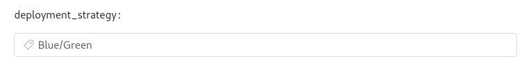
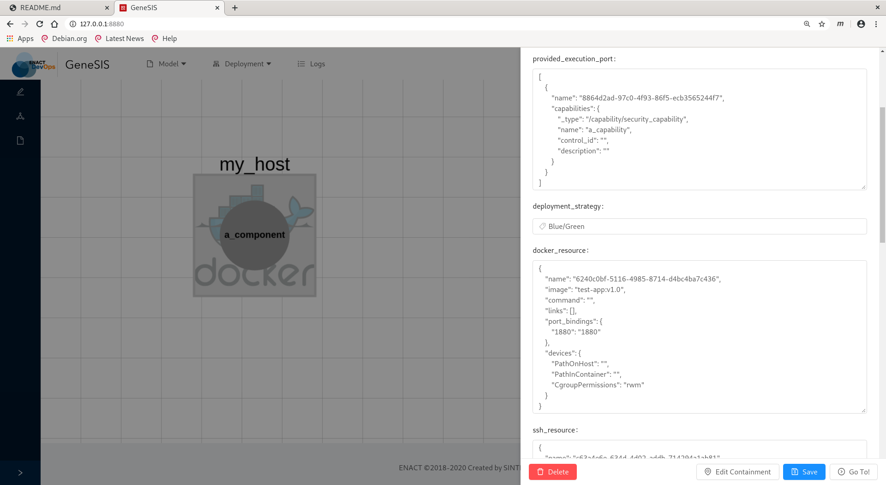
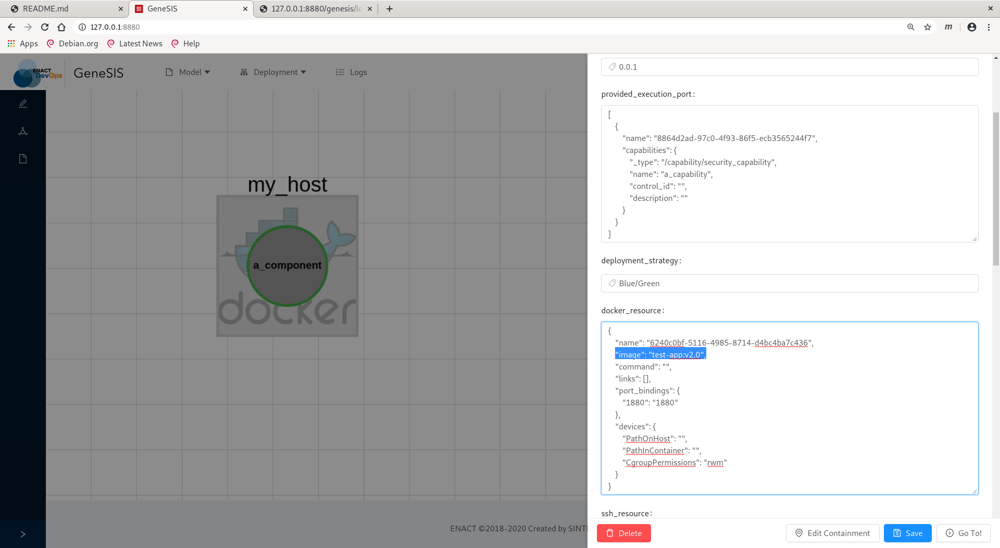

# Blue/Green Deployments

[Blue/Green deployments](https://docs.docker.com/engine/swarm/) are a
means to have zero downtime when deploying new version of our
software. The core idea is have a two twin infrastructure (so called
"blue" and "green" and some network equipment that routes the traffic
to one of those. At first, we simply deploy our first version on one
of these infrastructure (say blue for instance). When a new version is
available, we will deploy it on the other infrastructure (i.e.,
"green") and when everything is OK, we can switch the router in order
for the traffic to reach our new version green infrastructure. Should
anything bad happen, we can instantly rollback by switching back to
the blue infrastructure.

GeneSIS leverages [Docker
Swarm](https://docs.docker.com/engine/swarm/) to automate Blue/Green
deployments and this feature is only available on Docker hosts so far.

To do this, we must specify "Blue/Green" as the deployment strategy
used by our Docker component. That what we did in the following:




## Initial Deployment using GeneSIS

First we create an initial deployment model, as shown by the
screenshot below.  It consists of two components, namely a Docker host
(named `my_host`), and a Docker application deployed on top (named
`a_component`).

.

Note the configuration of our Docker component. First, its deployment
strategy is set to `Blue/Green`. Then, the Docker resources, which
appears on the right sidebar (as reproduced below) specify the Docker
image from which our component will be deployed, here
`fchauvel/test-app:v1.0`.

```json
{
    "name": "6240c0bf-5116-4985-8714-d4bc4ba7c436",
    "image": "test-app:v1.0",
    "command": "",
    "links": [],
    "port_bindings": {
        "1880": "1880"
    },
    "devices": {
        "PathOnHost": "",
        "PathInContainer": "",
        "CgroupPermissions": "rwm"
    }
}
```

Now we can use GeneSIS to deploy our component, by selecting
`Deployment`>`Deploy model from editor`.

When we return to our host, and we check the list of available
services, we see that a new service named `a_component` has been
provisioned from the image `test-app:v1.0`.

```shell

$ docker service ls
ID                  NAME                MODE                REPLICAS            IMAGE               PORTS
qnijwmupk05j        a_component         replicated          1/1                 test-app:v1.0       
```

## Releasing a New Version

We can now return to our deployment model and update the Docker image
from which our component is deployed, say from `test-app:v1.0` to
`test-app:v2.0`.



Now we can use GeneSIS to redeploy our component, by selecting again
`Deployment`>`Deploy model from editor`.

If we return right away to our host and check the list of available
services, we still see our service named `a_component` but it has been
redeployed from the version of our image.

```shell
$ docker service ls
ID                  NAME                MODE                REPLICAS            IMAGE               PORTS
qnijwmupk05j        a_component         replicated          2/1                 test-app:v2.0       
``` 

Note only did the image change, but the number of replicas has
increases, because Docker has provisioned the new container (from the
image v2.0) aside of the old version and waits a bit before to take
down the older one.


## Appendix: Building the `test-app` Image

Let us introduce a simple service as a running example of service that
can benefit from Blue/Green deployments. Our service is a single
Python application, using Flask to expose a single endpoint where it
shows its version number. Here is the Python code that we placed in
the file `app.py`.

```python
import os
import flask;

VERSION = os.environ["FC_APP_VERSION"] or "1.0"

app = flask.Flask(__name__)
app.config["DEBUG"] = True


@app.route('/', methods=['GET'])
def home():
    return "<h1>Service v%s</h1>" % VERSION

app.run(host="0.0.0.0")
```

This app comes along with a simple `requirements.txt` file, that
specifies its Python dependencies, here, flask basically.

``` 
flask
```

We can now bundle this application into a Docker image using the
following Dockerfile:

```dockerfile
FROM python:3.8-buster

ARG APP_VERSION=1.0

ENV FC_APP_VERSION=${APP_VERSION}

RUN apt-get --yes  update 

WORKDIR ./enact

COPY ./requirements.txt ./requirements.txt
COPY ./app.py ./app.py

RUN pip install -r requirements.txt

CMD python app.py
```
